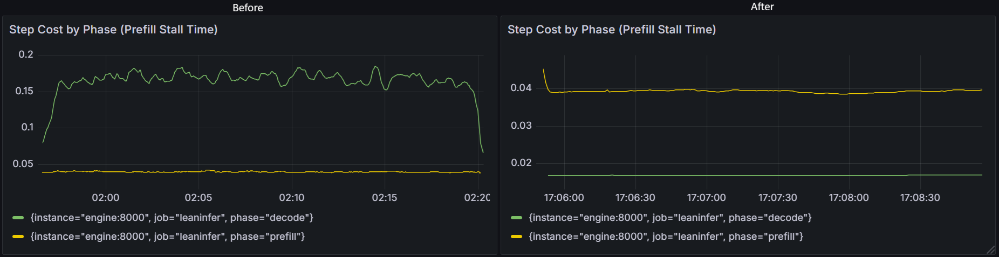
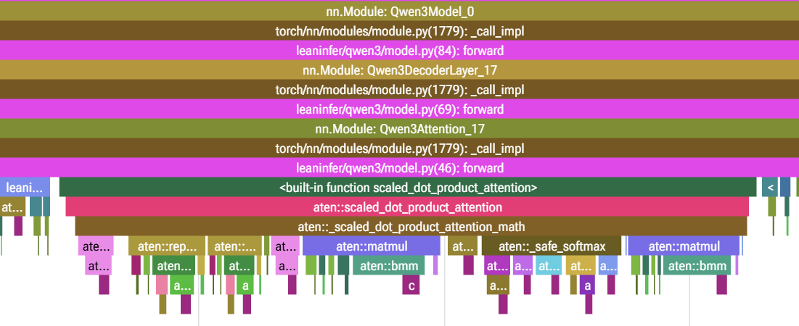

# lean-infer

WIP inference engine. Currently having continuous batching running with observability plugged in.

Requires an NVIDIA GPU. Developed on a GCP L4 running the Deep Learning VM stack image.

Run the engine standalone with a synthetic batch. Prints tok/s, no other metrics tracked.

```
uv run leaninfer
```

## Observability

Beyond what GCP's Deep Learning VM stack provides, you'll need

```bash
# Docker Compose to run the metrics stack
sudo apt install docker.io docker-compose-v2
# To configure the nvidia runtime so dcgm-exporter can see the GPU
sudo nvidia-ctk runtime configure --runtime=docker
# To load the nvidia runtime; reconnect to the instance after usermod
sudo systemctl restart docker
sudo usermod -aG docker $USER
```

Copy over the `.env.example` with no changes. Just makes docker compose commands cleaner.
Skip if you don't want dcgm-exporter scraping GPU metrics

```
cp .env.example .env
```

Start Prometheus, Grafana, and dcgm-exporter. Dry run with `config` to catch any YAML typos.

```
docker compose config >/dev/null && echo OK
docker compose up -d
```

On your computer, set up a tunnel to access the dashboards locally: Grafana at localhost:3000, Prometheus at localhost:9090

```
# This is the only thing you run locally, everything else should be on L4
gcloud compute ssh --zone <ZONE> <INSTANCE> \
 --project <PROJECT> \
 -- -N -L 3000:localhost:3000 -L 9090:localhost:9090 -L 9400:localhost:9400
```

Run the engine and see `localhost:3000` and `localhost:9090/targets`

```
uv run leaninfer
```

## Optimizations

### Making Decode 10x Faster

I conducted a few runs to get some nice graphs once I built observability and continuous batching. I settled at 32 slots, with prompts of 128 ± 96 tokens and output budgets of 256 ± 192 tokens. Both decode and prefill were much worse than the roofline numbers but since decode was ~97% of wall-clock time, I prioritized that. A decode step re-reads the fp32 weights (~2.4 GB) and KV cache (~3.6 GB), so on an L4's 300 GB/s, the floor is ~20 ms. So, decode was 8× off its bandwidth floor.



**The Process:** [insert profile image]

- The profile showed SDPA silently fell back to the MATH backend, showing up as separate `bmm`, `mul` and `softmax` kernels. It did not use the fu sed cuDNN attention kernels like I assumed it would. Previously, I had accepted the cost of running the model in fp32 because I was prototyping on my laptop, but I hadn't realized it would also change which attention backend was used.
- Once I swapped to bf16 and asserted cuDNN SDPA was used, attention got fast enough that I because host-bound with the GPU being mostly idle. CUDA Graphs became relevant as a fix. CUDA Graphs fundamentally require static shapes and static shapes are efficient only when using fused kernels. So this was an entire package that needed to be shipped together.

<p align="center">

</p>

**Results (in bf16)**: A 9.8x faster decode step, which also showed through improved decode throughput and wall clock time. The change to bf16 halved the bandwidth floor for both decode and prefill, but **curiously enough did nothing for prefill step time**.

|                          | before    | after       |     |
| ------------------------ | --------- | ----------- | --- |
| decode step              | 165 ms    | 16.9 ms     |     |
| prefill step             | 40 ms     | 40 ms       |     |
| decode throughput        | 188 tok/s | 1,470 tok/s |     |
| TPOT                     | 170 ms    | 21.8 ms     |     |
| 1024 requests wall clock | 23 min    | 3.0 min     |     |
|                          |           |             |     |

---
