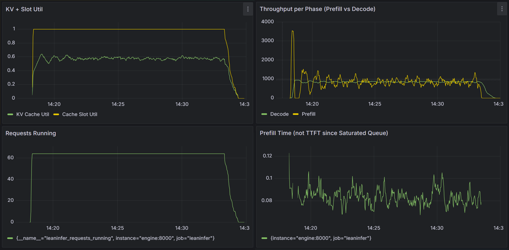
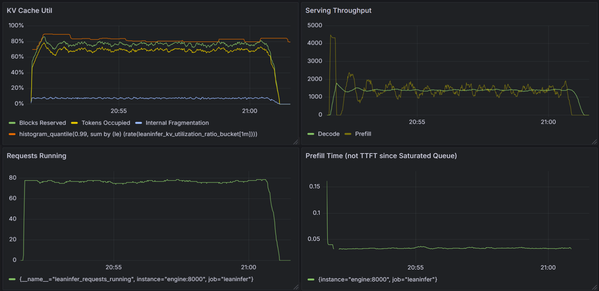
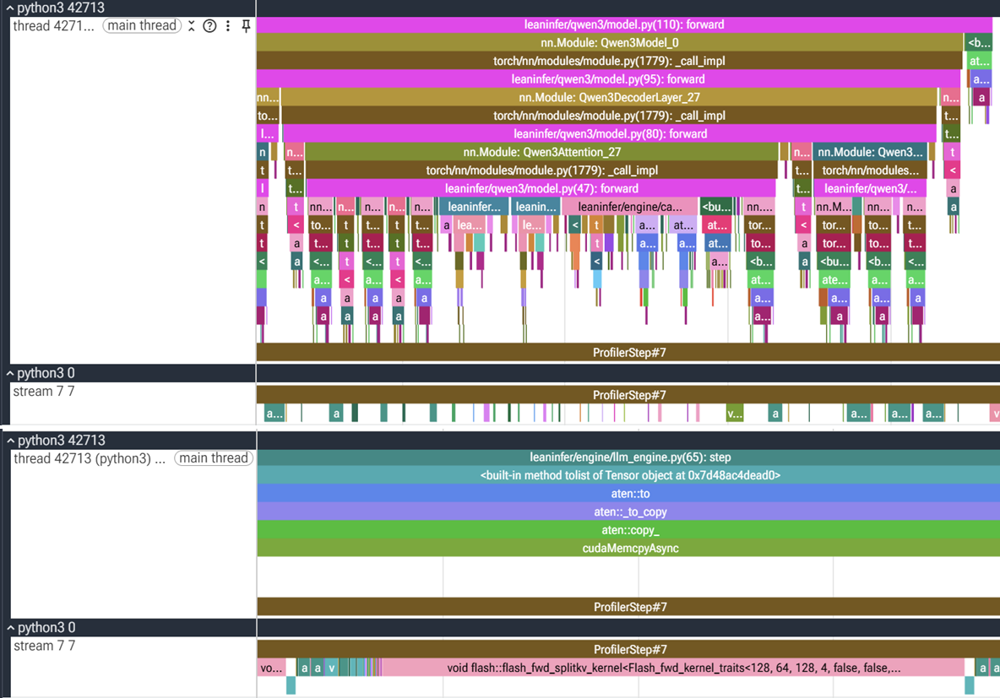

# lean-infer

An inference engine for Qwen3 0.6B, written from scratch in ~1000 lines: continuous batching, paged attention and CUDA graphs, instrumented with Prometheus + Grafana. It decodes a saturated batch at ~1,500 tok/s on an NVIDIA L4.

Developed and benchmarked on GCP's Deep Learning VM stack.

## Getting Started

Run the engine standalone with a synthetic batch. Turn on observability for the interesting stuff.

```
uv run leaninfer
```

## Observability

Beyond what GCP's Deep Learning VM stack provides, you'll need

```bash
# Docker Compose to run the metrics stack
sudo apt install docker.io docker-compose-v2

# (Optional) If you need GPU metrics,
# 1. Register the NVIDIA container runtime with Docker so dcgm-exporter can see the GPU
sudo nvidia-ctk runtime configure --runtime=docker
# 2. Copy over the `.env.example` with no changes. Just makes docker compose commands cleaner.
cp .env.example .env
# 3. load the nvidia runtime
sudo systemctl restart docker
sudo usermod -aG docker $USER
# Reconnect to the instance after usermod
```

Start Prometheus, Grafana, and dcgm-exporter.

```
docker compose up -d
```

On your computer, set up a tunnel to access the dashboards locally: Grafana at localhost:3000, Prometheus at localhost:9090

```
# This is the only thing you run locally, everything else should be on L4
gcloud compute ssh --zone <ZONE> <INSTANCE> \
 --project <PROJECT> \
 -- -N -L 3000:localhost:3000 -L 9090:localhost:9090 -L 9400:localhost:9400
```

Run the engine and check `localhost:3000` and `localhost:9090/targets`

```
uv run leaninfer
```

## Design and Challenges

### Preface: Why a Saturated, Offline Batch

Every optimization here targets throughput because a permanently full queue is the only workload regime where throughput measures the engine's performance itself. If I chose a workload below saturation, I would instead be measuring the arrival rate I picked rather than anything the engine is doing.

Two knobs, _mean inter-arrival rate_ and _burst arrival concentration_, can help test latency under realistic workloads, but a steady-state maximum throughput is something I should nail first.

### 10x Faster Decode

Once I built observability and continuous batching, I saw both decode and prefill were much worse than the roofline numbers. Since decode was ~97% of wall-clock time, I prioritized that.

Decode was 8× off its bandwidth floor (~20 ms) and SDPA had silently fallen back to the MATH backend (`bmm`, `mul`, `softmax` kernels instead of one cuDNN fused kernel). I had been prototyping the model in fp32 on cpu but after I switched over to a cloud GPU, I didn't realize I needed to swap to bf16/fp16 to use fused kernels.

<p align="center">

</p>

Once cuDNN SDPA was working, attention got fast enough that it became host-bound with the GPU being mostly idle. CUDA Graphs was built for this regime, so I implemented that next.


**Results (in bf16)**: A 9.8x faster decode step and improved decode throughput and wall clock time. Note: the change to bf16 halved the bandwidth floor (~10 ms), so we aren't quite comparing apples to apples.

|                          | before    | after       |
| ------------------------ | --------- | ----------- |
| decode step              | 165 ms    | 16.9 ms     |
| prefill step             | 40 ms     | 40 ms       |
| decode throughput        | 188 tok/s | 1,470 tok/s |
| TPOT                     | 170 ms    | 21.8 ms     |
| 1024 requests wall clock | 23 min    | 3.0 min     |

---

### PagedAttention and Workload Gaps

I changed the workload since prefill had been below the L4's ridge point so far, with an average ~400 token prompt length. This made it just another memory-bound workload. I set prompt length and max output tokens to now be uniformly distributed in `[512, 1024]` (which explains the periodicity of prefill throughput in the panel below), and I also bumped batch size to 64 requests.

> Note: The traditional characterization is that prefill is compute-bound while decode is memory-bound. I learned later this doesn't always hold true... \*_cue chunked prefill_\*. Until I build that alongside a unified token budget, I'll retain the same synthetic workload since prefill (with batch size set at B=1) will mostly be below the ridge point if using a real dataset like ShareGPT.

<p align="center">

</p>

KV cache utilization at ~60% became the next target for improvement, which can be targetted with paged KV cache. Keeping total kv memory constant, the previous 64 slots \* 2048 slot_length now became 512 num_blocks \* 256 block_size. Rather than hand-write a paged KV kernel, I chose to use Flash Attention's flash_attn_with_kvcache. However, this constrained my block size options since FA needed multiples of 256. I didn't have to think about the KV read path but paid for it in more internal fragmentation compared to, say, vLLM's default of 16. I also bumped batch size cpaacity to 128 to accommodate more requests; 128 is quite high though and I always pay a small CUDA Graph cost in capturing launches over all 128 requests, real or idle.

<p align="center">

</p>

TODO: a metrics table for comparison

The panels show "numbers go up" but there's a ton of nuance here:

- Honesty where honesty is due: The improvements to prefill throughput (Panel 2 yellow line) and prefill time (Panel 4) are almost completely attributed to FlashAttention.
- The improvements to KV cache utilization (Panel 1) and concurrency (Panel 3) are attributed to the Paged KV cache I built. This improvement represents a particular ideal setup: where Goodput is 100\% of the work done, i.e. no request or token generated by the engine is ever thrown away (no preemptions). The obvious cost for 100\% goodput is lower concurrency since I have to allow some blocks remain idle until they are eventually filled.

As mentioned above, I achieve a 100\% Goodput baseline by reserving every running request's full expected generation length (max output tokens). This artificial regime is a consequence of my workload: my workload is garbage (vocab IDs randomly generated), so a request will almost never emit a stop token and will likely exhaust its token budget, and is predictable (uniform in [512, 1024]). Any utilization knob I turn in this regime is just cherry picked to be flattering. Real workloads have an unbounded generation length (capped by an engine's max_new_token policy) that the scheduler can't reliably predict. The solution? Read on...

---

### Future Work: Chunked Prefill

<p align="center">

<br>
<em>Top: Prefill, eager. Bottom: Decode, CUDA Graph captured.</em>
</p>

Multiple threads all converge on implementing chunked prefill:

- The prefill path is still eager, which shows up as a ton of GPU idle time in the profiles above. Chunked prefill, with its fixed chunk size, is an ideal static shape for CUDA Graph capture. With CUDA graph captured chunked prefill, I expect to see a moderate decrease in prefill time.
- When prefill chunks are packed into the same budget as decode (unified token budget), I can stay compute-bound even with very short prompts since I won't be bound to prefill stalls like with my current batch B=1. So, swapping to a real dataset like ShareGPT would no longer impact performance.
- With ShareGPT's real prompts, I can't predict how many tokens will be generated since generation is unbounded. An adaptive admission policy is now required to maximize goodput and I definitely can't hack my way to a 100% goodput. I would have to gate admission of new requests when preemptions or goodput reach some tolerance limit.
